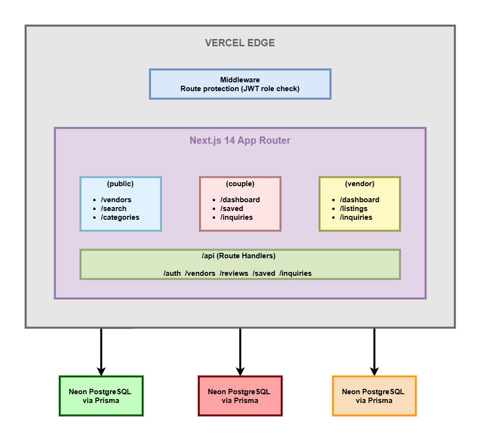
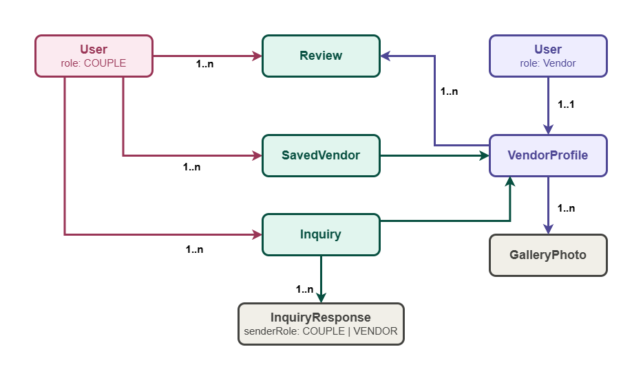

# Knotly — Wedding Vendor Directory

A full-stack wedding vendor marketplace built with Next.js 14 App Router, Prisma, and PostgreSQL. Knotly connects couples planning their wedding with vendors across seven categories: venues, photographers, caterers, florists, DJs, makeup artists, and wedding planners. The platform features two distinct authenticated portals (couple and vendor), an admin approval system, a real-time inquiry conversation system, and Cloudinary-powered image uploads.

**Live:** [knotly-wedding-vendor-directory-blue.vercel.app](https://knotly-wedding-vendor-directory-blue.vercel.app)  
**GitHub:** [github.com/AhmedIsmailKhalid/Knotly-Wedding-Vendor-Directory](https://github.com/AhmedIsmailKhalid/Knotly-Wedding-Vendor-Directory)

---

## The Problem

Wedding planning is fragmented. Couples spend hours across dozens of websites researching vendors, with no central place to browse, compare, save, and reach out to multiple vendor types at once. Vendors lack an affordable platform to showcase their work and receive qualified inquiries directly from engaged couples.

## The Solution

Knotly is a full marketplace, not just a directory. Couples get a searchable, filterable vendor directory with save lists, a structured inquiry system, and review capabilities. Vendors get a managed listing with photo gallery, an inquiry inbox with threaded conversation, and clear visibility into their booking pipeline. An admin layer ensures listing quality through an approval workflow before any vendor goes public.

---

## Architecture



### Key Architectural Decisions

**Next.js App Router with Server Components** — all data-fetching pages use React Server Components. The initial HTML is rendered server-side with data already included, resulting in zero client-side loading spinners on first paint. Client Components are used only where interactivity is required: search bars, forms, and save toggles.

**Three-layer authentication** — route protection is enforced at three independent levels: Proxy Middleware (edge, blocks unauthenticated requests before any page renders), Server Component session check (verifies role on every protected page), and API route authorization (every mutation re-validates ownership from the session, never from client-supplied data).

**Direct Cloudinary upload pipeline** — vendor photos are uploaded directly from the browser to Cloudinary, bypassing the Next.js server entirely. Only the resulting URL and publicId are sent to our API and stored in PostgreSQL. This prevents memory pressure on serverless functions and eliminates file size limits.

**Threaded inquiry conversation system** — inquiries support a multi-turn conversation model. Vendors can Reply (continues conversation), Accept (finalises booking), or Decline. Couples can send follow-up messages on active inquiries. Every message stores a `senderRole` field so both portals render the correct visual thread.

**PostgreSQL full-text search** — vendor search uses native PostgreSQL `ILIKE` queries across business name, bio, and location. No external search service required at this scale.

---

## Tech Stack

| Layer | Technology |
|---|---|
| Framework | Next.js 14 (App Router) |
| Language | TypeScript 5 |
| Styling | Tailwind CSS |
| ORM | Prisma 7 |
| Database | PostgreSQL via Neon (serverless) |
| Auth | NextAuth.js 4 (JWT, Credentials provider) |
| Validation | Zod |
| Image Storage | Cloudinary |
| Deployment | Vercel |

---

## Features

### Public / Couple Experience
- Browse all 7 vendor categories with filtering by category, location, and price range
- Debounced search with live suggestions
- Full vendor profile pages with photo gallery, bio, pricing, and reviews
- Save vendors to a shortlist with optimistic UI updates
- Multi-field booking inquiry form (event date, guest count, message)
- Threaded inquiry conversation with vendor follow-up support
- Leave reviews for vendors after an accepted inquiry

### Vendor Portal
- Multi-step listing creation wizard (basic info, pricing, gallery, review)
- Drag-and-drop photo upload directly to Cloudinary
- Gallery management with add and remove on existing listings
- Inquiry inbox with full conversation thread
- Three response types: Reply, Accept, Decline
- Edit listing details at any time
- Delete listing with automatic Cloudinary cleanup

### Admin Panel
- Platform stats dashboard (vendors, couples, inquiries, pending approvals)
- Vendor approval workflow — listings are hidden until approved
- Full user management table with role badges

---

## Database Schema



Key schema decisions:

- `VendorProfile.isApproved` defaults to `false`, requiring admin approval before public visibility
- `VendorProfile.slug` is a URL-safe unique identifier generated from the business name, never exposing internal UUIDs
- `InquiryStatus` enum covers `PENDING | REPLIED | ACCEPTED | DECLINED | CANCELLED`
- `InquiryResponse.senderRole` distinguishes vendor replies from couple follow-ups in the conversation thread
- `@@unique([coupleId, vendorId])` on `Review` enforces one review per couple per vendor at the database level

---

## Demo Accounts

All demo accounts use password: `Demo1234!`

| Role | Email | Description |
|---|---|---|
| Couple | couple@knotly.dev | Sarah & James — has active inquiries and saved vendors |
| Couple | couple2@knotly.dev | Emily & Tom — has an accepted booking and a review |
| Vendor | grand.estate@knotly.dev | The Grand Estate — venue with accepted inquiries |
| Vendor | bliss.co@knotly.dev | Bliss & Co Weddings — planner with a declined inquiry |
| Admin | admin@knotly.dev | Full admin panel access |

Demo credentials are also available via the **"Try a demo account"** panel on the login page.

---

## Running Locally

**Prerequisites:** Node.js 20+, a Neon PostgreSQL project, a Cloudinary account

```bash
git clone https://github.com/AhmedIsmailKhalid/Knotly-Wedding-Vendor-Directory.git
cd Knotly-Wedding-Vendor-Directory

npm install

cp .env.example .env.local
# Fill in: DATABASE_URL, DIRECT_URL, NEXTAUTH_SECRET, NEXTAUTH_URL,
# NEXT_PUBLIC_CLOUDINARY_CLOUD_NAME, CLOUDINARY_API_KEY,
# CLOUDINARY_API_SECRET, NEXT_PUBLIC_CLOUDINARY_UPLOAD_PRESET

npx prisma migrate dev
npx prisma generate
npm run seed
npm run dev
```

The app runs at `http://localhost:3000`

---

## Environment Variables

```env
# Database (Neon)
DATABASE_URL=             # Pooled connection string
DIRECT_URL=               # Direct connection string (for migrations)

# Auth
NEXTAUTH_SECRET=          # Random 32-char secret
NEXTAUTH_URL=             # Full app URL (http://localhost:3000 locally)

# Cloudinary
NEXT_PUBLIC_CLOUDINARY_CLOUD_NAME=
CLOUDINARY_API_KEY=
CLOUDINARY_API_SECRET=
NEXT_PUBLIC_CLOUDINARY_UPLOAD_PRESET=
```

---

## Project Structure

```
src/
├── app/
│   ├── (public)/          # Homepage, vendor directory, vendor profiles
│   ├── (couple)/          # Authenticated couple portal
│   ├── (vendor)/          # Authenticated vendor portal
│   ├── (admin)/           # Admin panel
│   ├── (auth)/            # Login and registration pages
│   └── api/               # REST API route handlers
├── components/
│   ├── auth/              # Login, register, demo credentials
│   ├── inquiry/           # Inquiry cards, response forms, conversation thread
│   ├── layout/            # Header, footer, user menu dropdown
│   ├── listing/           # Wizard steps, edit form, gallery manager
│   ├── reviews/           # Review form and display components
│   ├── ui/                # Primitive components (Badge, Skeleton, StarRating)
│   └── vendors/           # Vendor cards, filters, search bar, save button
├── lib/
│   ├── auth.ts            # NextAuth configuration
│   ├── prisma.ts          # Prisma client singleton
│   ├── constants/         # Category labels, price ranges, locations
│   ├── utils/             # cn(), formatDate(), formatCurrency(), generateSlug()
│   └── validations/       # Zod schemas for all forms and API inputs
├── types/                 # TypeScript type definitions
└── hooks/                 # useDebounce, useSavedVendor
prisma/
├── schema.prisma          # Database schema
├── seed.ts                # Demo data seeding script
└── migrations/            # Migration history
```

---

## Technical Highlights

Knotly demonstrates React Server Components, Server Actions, role-based multi-portal architecture, and a Cloudinary image upload pipeline — patterns that appear in almost every modern production SaaS product.